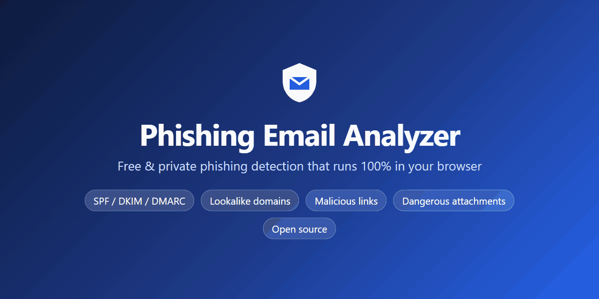

<div align="center">

# 🛡️ Phishing Email Analyzer

### Free, open-source phishing email checker. Detects spoofed senders, malicious links and dangerous attachments, 100% in your browser.

[](https://kapoordeepanshu.github.io/phishing-email-analyzer/)

[](https://github.com/kapoordeepanshu/phishing-email-analyzer/actions/workflows/ci.yml)
[](LICENSE)
[](https://www.python.org/)
[](pyproject.toml)
[](#-privacy)

**[🌐 Open the web app](https://kapoordeepanshu.github.io/phishing-email-analyzer/)** ·
[Quick start](#-quick-start) ·
[How to use](#-how-to-use-step-by-step) ·
[What it detects](#-what-it-detects) ·
[FAQ](#-faq) ·
[Contact](#-contact)



</div>

---

## ✨ Why this tool?

Received an email asking you to *"verify your account"*, *"pay an overdue invoice"* or *"open the attached document"*?
**Phishing Email Analyzer** tells you in seconds whether it's likely a scam, and **why**.

- 🔒 **Private by design:** the web version runs entirely in your browser using WebAssembly. Your email is **never uploaded** to any server.
- 🆓 **Free and open source:** MIT licensed, no account, no ads, no tracking.
- 🧠 **Explains every verdict:** a 0–100 risk score with the exact indicators behind it.
- 🧰 **Two ways to use it:** a point-and-click **web app** for everyone and a **Python CLI** for security analysts, SOC teams and automation.
- 📦 **Zero dependencies:** pure Python standard library.

It's a phishing detector, email header analyzer, SPF/DKIM/DMARC checker, malicious URL scanner and email
attachment analyzer in one tool.

---

## 🚀 Quick start

| I want to… | Do this |
|---|---|
| Check one email, no install | Open **[the web app](https://kapoordeepanshu.github.io/phishing-email-analyzer/)** and drop in your `.eml` file |
| Use the command line | `git clone https://github.com/kapoordeepanshu/phishing-email-analyzer.git && cd phishing-email-analyzer && python -m phishanalyzer samples/phishing_paypal.eml` |
| Install the `phishanalyzer` command | `pip install git+https://github.com/kapoordeepanshu/phishing-email-analyzer.git` |

---

## 📖 How to use (step by step)

### Option A: Web app (recommended for everyone)

1. **Save the suspicious email as a `.eml` file** (see [how to export an email](#-how-to-export-an-email-as-eml) below).
   Don't click any links or open attachments in it.
2. **Open the web app:** <https://kapoordeepanshu.github.io/phishing-email-analyzer/>
3. **Drag and drop the `.eml` file** onto the upload area, or click it to choose the file.
   *Alternatively*, open **"…or paste the raw message source"** and paste the full source ("Show original" in Gmail).
4. **Read the verdict:** `NO STRONG INDICATORS`, `LOW RISK`, `SUSPICIOUS` or `PHISHING / MALICIOUS`, with a 0–100 risk score.
5. **Explore the tabs** to understand why:
   - **Findings:** every indicator, ordered by severity, with evidence
   - **Sender:** From / Reply-To / Return-Path, SPF/DKIM/DMARC results, originating IP and relay path
   - **Links:** every URL with its real destination and what's wrong with it (links are shown as text, never clickable)
   - **Attachments:** real file type, hashes (SHA-256/MD5) and risks
6. *(Optional)* Click **Download JSON** to save the report, for example to attach to an IT/security ticket.
7. **If it's phishing:** don't reply, click or open anything. Report it to your IT team or email provider and delete it.

> 💡 Want to try it first? Click one of the **sample** buttons in the web app, or open the
> [PayPal phishing demo](https://kapoordeepanshu.github.io/phishing-email-analyzer/#sample=phishing_paypal.eml).

### Option B: Command line (analysts and automation)

1. **Requirements:** Python 3.9 or newer. Nothing else.
2. **Get the code:**
   ```bash
   git clone https://github.com/kapoordeepanshu/phishing-email-analyzer.git
   cd phishing-email-analyzer
   ```
3. **Analyse an email:**
   ```bash
   python -m phishanalyzer suspicious.eml
   ```
4. **Optional: install it as a command:**
   ```bash
   pip install .
   phishanalyzer suspicious.eml
   ```
5. **More options:**
   ```bash
   phishanalyzer mail.eml                          # full colour report
   phishanalyzer exports/ --summary                # every .eml in a folder, one line each
   phishanalyzer mail.eml --json report.json       # also save a JSON report
   phishanalyzer mail.eml --json - | jq .          # JSON only, to stdout
   cat mail.eml | phishanalyzer -                  # read from stdin
   phishanalyzer mail.eml --all-links              # list clean links too
   phishanalyzer mail.eml --fail-on suspicious     # exit code 2 if suspicious or worse
   ```
6. **Optional: VirusTotal reputation lookups.** Get a [free API key](https://www.virustotal.com/gui/join-us), then:
   ```bash
   export VT_API_KEY=your_key          # Windows PowerShell: $env:VT_API_KEY="your_key"
   phishanalyzer mail.eml --vt
   ```
   Only hashes and URLs are *looked up*. **Nothing is uploaded.** The free-tier rate limit (4/min) is respected automatically.

<details>
<summary><b>Example CLI output</b></summary>

```
 Verdict    :  PHISHING / MALICIOUS    Risk score: 100/100
 Findings   : 3 CRITICAL, 11 HIGH, 6 MEDIUM, 7 LOW, 1 INFO

 SENDER
  From         : "PayPal Security (service@paypal.com)" <security@paypa1-support.com>
  Reply-To     : <paypal.resolution.center@gmail.com>
  Origin IP    : 185.220.101.47
  Auth         : SPF=fail  DKIM=none  DMARC=fail

 LINKS (8 found, 6 suspicious)
  [!] http://paypa1-secure.xyz/login/verify.php?session=8812
      text  : https://www.paypal.com/signin
      - Lookalike domain imitating paypal (homoglyph/character substitution)
      - Link text shows a different domain than the real target

 ATTACHMENTS (1)
  [!] Invoice_8812.pdf.exe  (application/octet-stream, 44 B, content: pe)
      - Double extension disguises an executable (e.g. invoice.pdf.exe)
```
</details>

---

## 📨 How to export an email as `.eml`

| Email client | Steps |
|---|---|
| **Gmail** (web) | Open the email → **⋮ More** (top right) → **Download message** |
| **Outlook on the web / new Outlook** | Open the email → **… More actions** → **Save as** / **Download** |
| **Outlook desktop (classic)** | Saves `.msg` (not supported yet). Use Outlook on the web, *or* open the email → **File → Properties** → copy **Internet headers** and paste them into the web app for a header-only check |
| **Apple Mail** (macOS) | Select the email → **File → Save As…** → Format: **Raw Message Source** |
| **Thunderbird** | Select the email → **File → Save As → File** |
| **Yahoo Mail** | Open the email → **… More** → **View raw message** → copy everything and paste it into the web app |
| **Proton Mail** | Open the email → **⋮ More** → **Export** (or **View headers** to paste) |

---

## 🔍 What it detects

| Area | Checks |
|---|---|
| **Sender & authentication** | SPF, DKIM, DMARC and Microsoft compauth results · display name hiding a different address · brand name in display name from an unrelated or free-mail domain · **lookalike, typosquatted and punycode homograph domains** (e.g. `paypa1.com`, `rnicrosoft.com`, Cyrillic look-alikes) · Reply-To redirected to webmail · Return-Path and Message-ID mismatch · bulk/scripted mailers · relay path and originating IP |
| **Links / URLs** | link text showing a different domain than the real target · raw or obfuscated IP URLs · `user@host` tricks · brand impersonation in hostnames · URL shorteners · abused free hosting (web.app, pages.dev, workers.dev…) · high-risk TLDs · open redirects (incl. base64-encoded) · executable downloads · login pages over plain HTTP · `javascript:` / `data:` URIs · **unwraps Microsoft Safe Links, Proofpoint URL Defense and Google redirects** |
| **Attachments** | executables and scripts · double extensions (`invoice.pdf.exe`) and right-to-left override filenames · **real file type vs. extension** (magic bytes) · ISO/IMG/VHD disk images · **VBA macros** with auto-exec and download/exec calls · remote template injection · DDE · Equation Editor exploits · **PDF** JavaScript, `/Launch`, `/OpenAction`, embedded files, link-only lures · **HTML/SVG smuggling**, fake login pages, Telegram/Discord exfiltration · encrypted, nested and zip-bomb archives · MD5/SHA-1/SHA-256 hashes |
| **Content** | urgency and threats, credential requests, payment and gift-card lures, prize scams, CEO-fraud/BEC wording · HTML forms and password fields inside the email · scripts, iframes, meta refresh · zero-width-character filter evasion · fake `RE:` threads · QR-code phishing (quishing) hints · image-only bodies |

Findings are de-duplicated and weighted (Critical 45 · High 20 · Medium 8 · Low 3) into a **0–100 risk score**:

| Score | Verdict |
|---|---|
| 60–100 | 🔴 **PHISHING / MALICIOUS** |
| 30–59 | 🟠 **SUSPICIOUS** |
| 10–29 | 🟡 **LOW RISK** |
| 0–9 | 🟢 **NO STRONG INDICATORS** |

---

## 🔐 Privacy

- The **web app** downloads the analysis engine once (Python compiled to WebAssembly via [Pyodide](https://pyodide.org)) and then analyses
  your email **locally in the browser tab**. No email content, headers, links or attachments are sent anywhere.
  You can confirm this in your browser's developer tools (Network tab).
- No cookies, analytics or tracking.
- Attachments are **only read as bytes**. They're never opened, rendered or executed. Links are shown as text and are never fetched.
- The CLI works fully offline. The optional `--vt` flag sends only file **hashes** and **URLs** to VirusTotal, and only when you ask for it.

---

## ❓ FAQ

<details>
<summary><b>Is Phishing Email Analyzer really free?</b></summary>

Yes. It's open source under the MIT license, with no account, subscription, ads or usage limits. You can also host your own copy for free on GitHub Pages.
</details>

<details>
<summary><b>Is my email uploaded anywhere?</b></summary>

No. The web app runs the analysis inside your browser using WebAssembly. Your email never leaves your device. The only network
requests are for loading the page and the analysis engine itself, which you can verify in your browser's developer tools (F12 → Network).
</details>

<details>
<summary><b>Which file formats are supported?</b></summary>

Standard `.eml` files (RFC 822 / MIME), which Gmail, Outlook on the web, Apple Mail, Thunderbird and most other clients can export.
You can also paste the raw message source. Outlook's `.msg` format isn't supported yet (it's on the roadmap). See
[how to export an email](#-how-to-export-an-email-as-eml).
</details>

<details>
<summary><b>How accurate is it? Can I trust a "clean" result?</b></summary>

It uses well-known heuristics that security analysts check by hand, and it catches the vast majority of common phishing techniques.
However, **no tool is perfect**. A clean result doesn't prove an email is safe, and a flagged email isn't proof of malice. If something
feels off, verify with the sender through a channel you already trust (a known phone number, or the official website typed by hand).
</details>

<details>
<summary><b>Why does it say "No SPF/DKIM/DMARC results in headers"?</b></summary>

Authentication results are added by *your* mail server when it receives the message. Some exports (or copy-pasted content) drop these
headers. Export the **full original message** ("Download message" / "Show original" / "View source") so they're included.
</details>

<details>
<summary><b>A legitimate email was flagged. Why?</b></summary>

Marketing emails often use tracking redirects, link shorteners and third-party senders, which can trigger low or medium findings.
Look at *which* indicators fired: a few low-severity items on an email that passes SPF/DKIM/DMARC is usually fine.
If you believe it's a false positive, please [open an issue](https://github.com/kapoordeepanshu/phishing-email-analyzer/issues/new?template=detection-report.md)
with redacted details, which helps improve the rules.
</details>

<details>
<summary><b>Is it safe to analyse an email with a malicious attachment?</b></summary>

Yes. Attachments are only read as raw bytes to inspect their structure. Nothing is opened, rendered or executed, and links are never visited.
Still, **don't open the attachment yourself** on your computer.
</details>

<details>
<summary><b>Can I use it at work / in my SOC / in automation?</b></summary>

Yes, the MIT license allows commercial use. The CLI supports batch scanning, JSON output and `--fail-on` exit codes for pipelines,
and optional VirusTotal enrichment. It needs no dependencies, so it runs anywhere Python 3.9+ runs.
</details>

<details>
<summary><b>What should I do if an email is phishing?</b></summary>

1. Don't click links, open attachments or reply.
2. Report it: use your email client's **Report phishing** button, or forward it to your IT/security team.
3. If you already clicked or entered a password: **change that password immediately** (and anywhere you reused it),
   enable two-factor authentication, and tell your IT team or bank.
4. Delete the email.
</details>

<details>
<summary><b>How do I host my own copy of the web app?</b></summary>

Fork this repository → **Settings → Pages → Source: GitHub Actions** → push to `main`. The included workflow runs the tests and deploys
the site. To run it locally: `python -m http.server 8000` in the repo root, then open <http://localhost:8000/web/>.
</details>

---

## 🏗️ How it works

```
.eml ─► parser ─┬─► headers.py      sender, SPF/DKIM/DMARC, relay path
                ├─► links.py        every URL from text, HTML, forms, PDFs, Office files, HTML attachments
                ├─► attachments.py  magic bytes, archives, OOXML/OLE macros, PDF, HTML  ──► extracted URLs
                ├─► content.py      social-engineering language, inline HTML threats
                └─► intel.py        (optional, CLI) VirusTotal lookups
                         │
                findings ─► merge ─► weighted score ─► verdict ─► terminal / JSON / web UI
```

```
phishing-email-analyzer/
├── phishanalyzer/   # analysis engine + CLI (pure Python, stdlib only)
├── web/             # static web app (runs the engine via Pyodide)
├── samples/         # synthetic, harmless sample emails + generator
├── tests/           # unit tests
└── docs/            # preview images
```

---

## ⚠️ Limitations

- Heuristic analysis: treat findings as reasons to look closer, not as absolute proof.
- SPF/DKIM/DMARC are read from the receiving server's headers. DKIM signatures aren't re-verified and DNS isn't queried.
- RAR/7z contents, password-protected archives and heavily obfuscated macros can't be fully inspected.
- The built-in brand list is focused on the most-impersonated brands. Contributions are welcome.

## 🗺️ Roadmap

- [ ] Outlook `.msg` support
- [ ] Domain age (RDAP) and live SPF/DMARC/MX lookups in the CLI
- [ ] Local DKIM signature verification
- [ ] QR-code decoding in images and PDFs (quishing)
- [ ] Recursive analysis of attached emails and nested archives
- [ ] Opt-in threat intel: URLhaus, PhishTank, Google Safe Browsing, AbuseIPDB
- [ ] Larger, community-maintained brand and lookalike list, plus a bundled public-suffix list
- [ ] IMAP inbox scanning and Gmail/Outlook add-ins
- [ ] Plain-language "what to do now" advice per finding
- [ ] PDF/Markdown report export and IOC export (CSV/STIX)
- [ ] YARA and YAML rule plug-ins
- [ ] Benchmark against public phishing datasets in CI

Have an idea? [Open a feature request](https://github.com/kapoordeepanshu/phishing-email-analyzer/issues).

## 🤝 Contributing

Contributions, bug reports and detection improvements are very welcome. See [CONTRIBUTING.md](CONTRIBUTING.md).
Please **don't attach real emails** to issues. Share redacted headers or indicators instead.

If this project helps you, please **⭐ star the repository**. It helps others find it.

## 📬 Contact

**Deepanshu Kapoor**

- 🐙 GitHub: [@kapoordeepanshu](https://github.com/kapoordeepanshu)
- 🐞 Bugs, false positives and feature requests: [GitHub Issues](https://github.com/kapoordeepanshu/phishing-email-analyzer/issues)
- 🔐 Security vulnerabilities in this tool: please report them privately (see [SECURITY.md](SECURITY.md))

## 📄 License

[MIT](LICENSE) © 2026 Deepanshu Kapoor

<sub>Keywords: phishing email analyzer, phishing detector, check if email is phishing, email header analyzer, SPF DKIM DMARC checker,
malicious link checker, email attachment scanner, eml analyzer, spoofed email detection, lookalike domain detection, homograph attack,
business email compromise (BEC), cybersecurity tool, SOC tool, blue team, open source.</sub>
